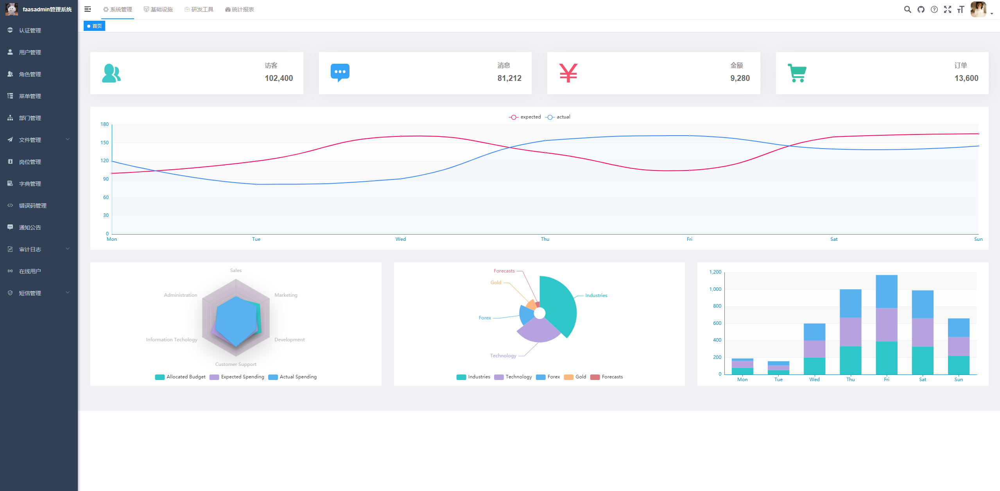

    
    
    
    
    
    
    

[介绍](#介绍) | [软件架构](#软件架构)| [技术选型](#技术选型) | [文档/演示](#文档演示) | [项目截图](#项目截图)
 
 
临时文档地址：https://www.yuque.com/fendo-ubr0z/doc  
启动器启动示例，在群文件里 
# faasadmin 介绍

>本系统得以完成，完全是站在巨人的肩膀上，要多谢前辈们的奉献，由衷的感谢若依，芋道源码，StarBlues，正是由于他们的辛勤付出，我这边才能在短时间内，将该系统做出来，否则的话，全靠我一个人不知要何年何月才能做完。

**本系统由于定位是用于互联网项目开发，提供了一整套解决方法，所以一开始就往商业化这块发展的，没办法，我这也需要发展，希望各位老板多多支持，所采用的一些技术，本文基本上都做了解答，有时间的自行研究，所以对系统部分代码做了加密，请谅解，商业合作请联系客服!**

承接各类APP，小程序，管理系统开发，技术实力这块毋庸置疑，多年开发经验全心为你服务，有这方面需要的联系我们合作。

本人很早就有想法，用JAVA做一个插件式的框架，也研究过很多一些框架以及技术，由于各种各样的原因导致一直没有时间深入，在2021年9月份左右，下定决心，要做一个插件式系统出来，用于互联网项目开发，如各类小程序，公众号，APP后台，然后就调研了下，目前的技术，有现成的一些框架，将他们集成起来就可以了，刚开始想从0开始搞，考虑到只有一个人，这个开发周期不知道要多久，所以就选了一些现成的后台管理系统，在上面扩展，经过几个月的开发，终于完成了第一个版本，核心的几个功能全部实现了，如：系统加密，系统授权，系统安装，应用市场等等，以及将商城做成了一个插件，绝大部分时间都花在商城上去了，如果是单单集成插件功能的话，很容易，我想要的是一整套，所以更重要的是插件市场这块的功能，目前已基本上完成，不敢说100%没问题，还有待测试，插件的安装与卸载可能有缓存，这个问题不大，通过重启系统，都能解决，在该系统上面开发的商城运行良好，目前还没发现啥问题。

插件式开发框架，主程序提供基础功能，通过插件的形式扩展，插件其实就是一个应用，比如商城，CMS，跑腿，外卖，这些应用全部做成插件，按应用收费，然后在主程序里可以在线安装，卸载，更新，备份等等，现在都实现了。

取名为faas-admin，faas中文就是"功能即服务"（或称为 FaaS）是一种云计算服务，它允许开发人员以功能的形式来构建、计算、运行和管理这些应用包，无需维护自己的基础架构，对应的就是"功能即插件"。

目前系统还是第一个版本，还在慢慢发展中，一些核心功能全部实现了，还有其他一些想法有待实现，时间有限，毕竟目前只有我一个人开发，时间精力有限。

faasadmin主要有以下几个亮点：

>1.系统支持全部加密+模块混淆。 
>2.通过启动器启动项目,实现解密,全方位保护源代码。 
>3.可视化安装,系统提供可视化安装引导,下一步,下一步,即可配置系统。 
>4.多模块划分，层次清晰，内置多种service,可按需引入,即可组装成想要的应用。 
>5.完善的插件机制,可在线安装,卸载,备份,以及更新,安装时自动初始化数据库表，以及卸载时删除相关表等等。 
>6.基于spring生态，原汁原味使用JAVA开发插件。 
>7.内置各种框架。 

# 软件架构

faasadmin是在若依pro框架基础上扩展的，所以继承了很多功能过来，导致系统有些庞大，有些可能用不到，faasadmin的定位并不是用来做一些大型的后台管理系统，而是用来做一些互联网上的热门项目，追求快，内置各种模块，组合起来，可以快速的实现MVP，专注于微信生态，适用于小程序，公众号，APP，网站等等，系统自带了一些模块，如会员模块，支付模块，商品模块，物流模块，积分模块，订单模块，cms模块，IM模块，按需将这些模块组合起来就能快速做成一个商城，知识付费，跑腿，外卖，网站等等。

# 技术选型

## 后端

<table class="ne-table" style="width: 750px;">
	<colgroup>
		<col width="250">
			<col width="250">
				<col width="249">
	</colgroup>
	<tbody class="ne-table-inner">
		<tr class="ne-tr">
			<td class="ne-td" data-col="0">
				

					<ne-p id="ub8e50e51" data-lake-id="ub8e50e51" ne-alignment="left">
						<ne-text id="uce543835" ne-bold="true" ne-fontsize="16" >
							框架
						</ne-text>
						
							 
						
					</ne-p>
				

				

				

			</td>
			<td class="ne-td" data-col="1">
				

					<ne-p id="u8f069e31" data-lake-id="u8f069e31" ne-alignment="left">
						<ne-text id="u4e08ac18" ne-bold="true" ne-fontsize="16" >
							说明
						</ne-text>
						
							 
						
					</ne-p>
				

				

				

			</td>
			<td class="ne-td" data-col="2">
				

					<ne-p id="u4ac0a7b2" data-lake-id="u4ac0a7b2" ne-alignment="left">
						<ne-text id="ub88dd7c1" ne-bold="true" ne-fontsize="16" >
							版本
						</ne-text>
						
							 
						
					</ne-p>
				

				

				

			</td>
		</tr>
		<tr class="ne-tr">
			<td class="ne-td" data-col="0">
				

					<ne-p id="u957fc498" data-lake-id="u957fc498" ne-alignment="left">
						<a class="ne-link" href="https://gitee.com/link?target=https%3A%2F%2Fspring.io%2Fprojects%2Fspring-boot"
						target="_blank">
							<ne-text id="u7cbf5df2">
								Spring Boot
							</ne-text>
						</a>
						
							 
						
					</ne-p>
				

				

				

			</td>
			<td class="ne-td" data-col="1">
				

					<ne-p id="u4285a302" data-lake-id="u4285a302" ne-alignment="left">
						<ne-text id="uaefd3ff4" ne-fontsize="16" >
							应用开发框架
						</ne-text>
						
							 
						
					</ne-p>
				

				

				

			</td>
			<td class="ne-td" data-col="2">
				

					<ne-p id="u5a667705" data-lake-id="u5a667705" ne-alignment="left">
						<ne-text id="ufdc24d55" ne-fontsize="16" >
							2.5.10
						</ne-text>
						
							 
						
					</ne-p>
				

				

				

			</td>
		</tr>
		<tr class="ne-tr">
			<td class="ne-td" data-col="0" >
				

					<ne-p id="u81269e1f" data-lake-id="u81269e1f" ne-alignment="left">
						<a class="ne-link" href="https://gitee.com/link?target=https%3A%2F%2Fwww.mysql.com%2Fcn%2F"
						target="_blank">
							<ne-text id="u5a8d0b6a">
								MySQL
							</ne-text>
						</a>
						
							 
						
					</ne-p>
				

				

				

			</td>
			<td class="ne-td" data-col="1" >
				

					<ne-p id="ua59ee55c" data-lake-id="ua59ee55c" ne-alignment="left">
						<ne-text id="u42b44b1a" ne-fontsize="16">
							数据库服务器
						</ne-text>
						
							 
						
					</ne-p>
				

				

				

			</td>
			<td class="ne-td" data-col="2" >
				

					<ne-p id="u68c13fab" data-lake-id="u68c13fab" ne-alignment="left">
						<ne-text id="uc3f541aa" ne-fontsize="16" >
							5.7
						</ne-text>
						
							 
						
					</ne-p>
				

				

				

			</td>
		</tr>
		<tr class="ne-tr">
			<td class="ne-td" data-col="0">
				

					<ne-p id="u5545beae" data-lake-id="u5545beae" ne-alignment="left">
						<a class="ne-link" href="https://gitee.com/link?target=https%3A%2F%2Fgithub.com%2Falibaba%2Fdruid"
						target="_blank">
							<ne-text id="u608b3eaa">
								Druid
							</ne-text>
						</a>
						
							 
						
					</ne-p>
				

				

				

			</td>
			<td class="ne-td" data-col="1">
				

					<ne-p id="ub3355c95" data-lake-id="ub3355c95" ne-alignment="left">
						<ne-text id="u9010a6b0" ne-fontsize="16" >
							JDBC 连接池、监控组件
						</ne-text>
						
							 
						
					</ne-p>
				

				

				

			</td>
			<td class="ne-td" data-col="2">
				

					<ne-p id="u7f579156" data-lake-id="u7f579156" ne-alignment="left">
						<ne-text id="u979f4ea6" ne-fontsize="16" >
							1.2.8
						</ne-text>
						
							 
						
					</ne-p>
				

				

				

			</td>
		</tr>
		<tr class="ne-tr">
			<td class="ne-td" data-col="0" >
				

					<ne-p id="u1e87cbc1" data-lake-id="u1e87cbc1" ne-alignment="left">
						<a class="ne-link" href="https://gitee.com/link?target=https%3A%2F%2Fmp.baomidou.com%2F"
						target="_blank">
							<ne-text id="u6b2ff3b9">
								MyBatis Plus
							</ne-text>
						</a>
						
							 
						
					</ne-p>
				

				

				

			</td>
			<td class="ne-td" data-col="1" >
				

					<ne-p id="u78b8a1c0" data-lake-id="u78b8a1c0" ne-alignment="left">
						<ne-text id="u0a774214" ne-fontsize="16" >
							MyBatis 增强工具包
						</ne-text>
						
							 
						
					</ne-p>
				

				

				

			</td>
			<td class="ne-td" data-col="2" >
				

					<ne-p id="ua05a3f41" data-lake-id="ua05a3f41" ne-alignment="left">
						<ne-text id="u27521712" ne-fontsize="16" >
							3.5.1
						</ne-text>
						
							 
						
					</ne-p>
				

				

				

			</td>
		</tr>
		<tr class="ne-tr">
			<td class="ne-td" data-col="0">
				

					<ne-p id="u3353fd06" data-lake-id="u3353fd06" ne-alignment="left">
						<a class="ne-link" href="https://gitee.com/link?target=https%3A%2F%2Fdynamic-datasource.com%2F"
						target="_blank">
							<ne-text id="ucd20e905">
								Dynamic Datasource
							</ne-text>
						</a>
						
							 
						
					</ne-p>
				

				

				

			</td>
			<td class="ne-td" data-col="1">
				

					<ne-p id="udfeff504" data-lake-id="udfeff504" ne-alignment="left">
						<ne-text id="u15648572" ne-fontsize="16" >
							动态数据源
						</ne-text>
						
							 
						
					</ne-p>
				

				

				

			</td>
			<td class="ne-td" data-col="2">
				

					<ne-p id="uf2f1c81e" data-lake-id="uf2f1c81e" ne-alignment="left">
						<ne-text id="uecbb1c53" ne-fontsize="16" >
							3.5.0
						</ne-text>
						
							 
						
					</ne-p>
				

				

				

			</td>
		</tr>
		<tr class="ne-tr">
			<td class="ne-td" data-col="0" >
				

					<ne-p id="uc62f992b" data-lake-id="uc62f992b" ne-alignment="left">
						<a class="ne-link" href="https://gitee.com/link?target=https%3A%2F%2Fredis.io%2F"
						target="_blank">
							<ne-text id="u6b26f59c">
								Redis
							</ne-text>
						</a>
						
							 
						
					</ne-p>
				

				

				

			</td>
			<td class="ne-td" data-col="1" >
				

					<ne-p id="u924780a8" data-lake-id="u924780a8" ne-alignment="left">
						<ne-text id="u74b0065a" ne-fontsize="16" >
							key-value 数据库
						</ne-text>
						
							 
						
					</ne-p>
				

				

				

			</td>
			<td class="ne-td" data-col="2" >
				

					<ne-p id="ud378d8c9" data-lake-id="ud378d8c9" ne-alignment="left">
						<ne-text id="uebd564de" ne-fontsize="16" >
							5.0
						</ne-text>
						
							 
						
					</ne-p>
				

				

				

			</td>
		</tr>
		<tr class="ne-tr">
			<td class="ne-td" data-col="0">
				

					<ne-p id="uea951222" data-lake-id="uea951222" ne-alignment="left">
						<a class="ne-link" href="https://gitee.com/link?target=https%3A%2F%2Fgithub.com%2Fredisson%2Fredisson"
						target="_blank">
							<ne-text id="u799d9af6">
								Redisson
							</ne-text>
						</a>
						
							 
						
					</ne-p>
				

				

				

			</td>
			<td class="ne-td" data-col="1">
				

					<ne-p id="ue95df1ac" data-lake-id="ue95df1ac" ne-alignment="left">
						<ne-text id="ua3aca03a" ne-fontsize="16" >
							Redis 客户端
						</ne-text>
						
							 
						
					</ne-p>
				

				

				

			</td>
			<td class="ne-td" data-col="2">
				

					<ne-p id="u1d10f7f3" data-lake-id="u1d10f7f3" ne-alignment="left">
						<ne-text id="udbbc0e72" ne-fontsize="16" >
							3.16.8
						</ne-text>
						
							 
						
					</ne-p>
				

				

				

			</td>
		</tr>
		<tr class="ne-tr">
			<td class="ne-td" data-col="0" >
				

					<ne-p id="u5a7f06e7" data-lake-id="u5a7f06e7" ne-alignment="left">
						<a class="ne-link" href="https://gitee.com/link?target=https%3A%2F%2Fgithub.com%2Fspring-projects%2Fspring-framework%2Ftree%2Fmaster%2Fspring-webmvc"
						target="_blank">
							<ne-text id="uebed5c48">
								Spring MVC
							</ne-text>
						</a>
						
							 
						
					</ne-p>
				

				

				

			</td>
			<td class="ne-td" data-col="1" >
				

					<ne-p id="ucbf873af" data-lake-id="ucbf873af" ne-alignment="left">
						<ne-text id="u94f38f88" ne-fontsize="16" >
							MVC 框架
						</ne-text>
						
							 
						
					</ne-p>
				

				

				

			</td>
			<td class="ne-td" data-col="2" >
				

					<ne-p id="u58e59693" data-lake-id="u58e59693" ne-alignment="left">
						<ne-text id="u84d1db03" ne-fontsize="16" >
							5.3.16
						</ne-text>
						
							 
						
					</ne-p>
				

				

				

			</td>
		</tr>
		<tr class="ne-tr">
			<td class="ne-td" data-col="0">
				

					<ne-p id="u397f526e" data-lake-id="u397f526e" ne-alignment="left">
						<a class="ne-link" href="https://gitee.com/link?target=https%3A%2F%2Fgithub.com%2Fspring-projects%2Fspring-security"
						target="_blank">
							<ne-text id="u7201e7d5">
								Spring Security
							</ne-text>
						</a>
						
							 
						
					</ne-p>
				

				

				

			</td>
			<td class="ne-td" data-col="1">
				

					<ne-p id="u38f28739" data-lake-id="u38f28739" ne-alignment="left">
						<ne-text id="u30810197" ne-fontsize="16" >
							Spring 安全框架
						</ne-text>
						
							 
						
					</ne-p>
				

				

				

			</td>
			<td class="ne-td" data-col="2">
				

					<ne-p id="ubac9e398" data-lake-id="ubac9e398" ne-alignment="left">
						<ne-text id="u69859e2d" ne-fontsize="16" >
							5.5.5
						</ne-text>
						
							 
						
					</ne-p>
				

				

				

			</td>
		</tr>
		<tr class="ne-tr">
			<td class="ne-td" data-col="0" >
				

					<ne-p id="u7d2233d8" data-lake-id="u7d2233d8" ne-alignment="left">
						<a class="ne-link" href="https://gitee.com/link?target=https%3A%2F%2Fgithub.com%2Fhibernate%2Fhibernate-validator"
						target="_blank">
							<ne-text id="ubc9da8c6">
								Hibernate Validator
							</ne-text>
						</a>
						
							 
						
					</ne-p>
				

				

				

			</td>
			<td class="ne-td" data-col="1" >
				

					<ne-p id="u6688e391" data-lake-id="u6688e391" ne-alignment="left">
						<ne-text id="u683e4990" ne-fontsize="16" >
							参数校验组件
						</ne-text>
						
							 
						
					</ne-p>
				

				

				

			</td>
			<td class="ne-td" data-col="2" >
				

					<ne-p id="u59f7790f" data-lake-id="u59f7790f" ne-alignment="left">
						<ne-text id="u11ccbaac" ne-fontsize="16" >
							6.2.2
						</ne-text>
						
							 
						
					</ne-p>
				

				

				

			</td>
		</tr>
		<tr class="ne-tr">
			<td class="ne-td" data-col="0" >
				

					<ne-p id="u5796e4b7" data-lake-id="u5796e4b7" ne-alignment="left">
						<a class="ne-link" href="https://gitee.com/link?target=https%3A%2F%2Fgithub.com%2Fquartz-scheduler"
						target="_blank">
							<ne-text id="u681c1aa6">
								Quartz
							</ne-text>
						</a>
						
							 
						
					</ne-p>
				

				

				

			</td>
			<td class="ne-td" data-col="1" >
				

					<ne-p id="u46c783a0" data-lake-id="u46c783a0" ne-alignment="left">
						<ne-text id="u0ef38f4e" ne-fontsize="16" >
							任务调度组件
						</ne-text>
						
							 
						
					</ne-p>
				

				

				

			</td>
			<td class="ne-td" data-col="2" >
				

					<ne-p id="u87b7eb95" data-lake-id="u87b7eb95" ne-alignment="left">
						<ne-text id="uff96e4d0" ne-fontsize="16" >
							2.3.2
						</ne-text>
						
							 
						
					</ne-p>
				

				

				

			</td>
		</tr>
		<tr class="ne-tr">
			<td class="ne-td" data-col="0">
				

					<ne-p id="u7c445bd2" data-lake-id="u7c445bd2" ne-alignment="left">
						<a class="ne-link" href="https://gitee.com/xiaoym/knife4j" target="_blank">
							<ne-text id="ua95027f9">
								Knife4j
							</ne-text>
						</a>
						
							 
						
					</ne-p>
				

				

				

			</td>
			<td class="ne-td" data-col="1">
				

					<ne-p id="ud24a1c5e" data-lake-id="ud24a1c5e" ne-alignment="left">
						<ne-text id="u166d8b70" ne-fontsize="16" >
							Swagger 增强 UI 实现
						</ne-text>
						
							 
						
					</ne-p>
				

				

				

			</td>
			<td class="ne-td" data-col="2">
				

					<ne-p id="u3cfd6afd" data-lake-id="u3cfd6afd" ne-alignment="left">
						<ne-text id="u2c4d4f67" ne-fontsize="16" >
							3.0.2
						</ne-text>
						
							 
						
					</ne-p>
				

				

				

			</td>
		</tr>
		<tr class="ne-tr">
			<td class="ne-td" data-col="0" >
				

					<ne-p id="ud1c80d12" data-lake-id="ud1c80d12" ne-alignment="left">
						<a class="ne-link" href="https://gitee.com/link?target=https%3A%2F%2Fgithub.com%2Fresilience4j%2Fresilience4j"
						target="_blank">
							<ne-text id="u4c56bafd">
								Resilience4j
							</ne-text>
						</a>
						
							 
						
					</ne-p>
				

				

				

			</td>
			<td class="ne-td" data-col="1" >
				

					<ne-p id="u7dfe9381" data-lake-id="u7dfe9381" ne-alignment="left">
						<ne-text id="u170a9620" ne-fontsize="16" >
							服务保障组件
						</ne-text>
						
							 
						
					</ne-p>
				

				

				

			</td>
			<td class="ne-td" data-col="2" >
				

					<ne-p id="ua64de1a8" data-lake-id="ua64de1a8" ne-alignment="left">
						<ne-text id="u53084ca6" ne-fontsize="16" >
							1.7.0
						</ne-text>
						
							 
						
					</ne-p>
				

				

				

			</td>
		</tr>
		<tr class="ne-tr">
			<td class="ne-td" data-col="0">
				

					<ne-p id="u3df0aeef" data-lake-id="u3df0aeef" ne-alignment="left">
						<a class="ne-link" href="https://gitee.com/link?target=https%3A%2F%2Fskywalking.apache.org%2F"
						target="_blank">
							<ne-text id="u3f80845c">
								SkyWalking
							</ne-text>
						</a>
						
							 
						
					</ne-p>
				

				

				

			</td>
			<td class="ne-td" data-col="1">
				

					<ne-p id="uc69a5a80" data-lake-id="uc69a5a80" ne-alignment="left">
						<ne-text id="u8f6e5be3" ne-fontsize="16" >
							分布式应用追踪系统
						</ne-text>
						
							 
						
					</ne-p>
				

				

				

			</td>
			<td class="ne-td" data-col="2">
				

					<ne-p id="ucada6f97" data-lake-id="ucada6f97" ne-alignment="left">
						<ne-text id="ubfb59cd3" ne-fontsize="16" >
							8.5.0
						</ne-text>
						
							 
						
					</ne-p>
				

				

				

			</td>
		</tr>
		<tr class="ne-tr">
			<td class="ne-td" data-col="0" >
				

					<ne-p id="u05188f20" data-lake-id="u05188f20" ne-alignment="left">
						<a class="ne-link" href="https://gitee.com/link?target=https%3A%2F%2Fgithub.com%2Fcodecentric%2Fspring-boot-admin"
						target="_blank">
							<ne-text id="u81c696e5">
								Spring Boot Admin
							</ne-text>
						</a>
						
							 
						
					</ne-p>
				

				

				

			</td>
			<td class="ne-td" data-col="1" >
				

					<ne-p id="u8f43621a" data-lake-id="u8f43621a" ne-alignment="left">
						<ne-text id="u59dee3bd" ne-fontsize="16" >
							Spring Boot 监控平台
						</ne-text>
						
							 
						
					</ne-p>
				

				

				

			</td>
			<td class="ne-td" data-col="2" >
				

					<ne-p id="u16e76e03" data-lake-id="u16e76e03" ne-alignment="left">
						<ne-text id="u4eab6c50" ne-fontsize="16" >
							2.4.2
						</ne-text>
						
							 
						
					</ne-p>
				

				

				

			</td>
		</tr>
		<tr class="ne-tr">
			<td class="ne-td" data-col="0">
				

					<ne-p id="u023165b4" data-lake-id="u023165b4" ne-alignment="left">
						<a class="ne-link" href="https://gitee.com/link?target=https%3A%2F%2Fgithub.com%2FFasterXML%2Fjackson"
						target="_blank">
							<ne-text id="u7e9fa45d">
								Jackson
							</ne-text>
						</a>
						
							 
						
					</ne-p>
				

				

				

			</td>
			<td class="ne-td" data-col="1">
				

					<ne-p id="u30cf0150" data-lake-id="u30cf0150" ne-alignment="left">
						<ne-text id="ubc16fdc9" ne-fontsize="16" >
							JSON 工具库
						</ne-text>
						
							 
						
					</ne-p>
				

				

				

			</td>
			<td class="ne-td" data-col="2">
				

					<ne-p id="udb1a01f4" data-lake-id="udb1a01f4" ne-alignment="left">
						<ne-text id="u884dd92b" ne-fontsize="16" >
							2.12.6
						</ne-text>
						
							 
						
					</ne-p>
				

				

				

			</td>
		</tr>
		<tr class="ne-tr">
			<td class="ne-td" data-col="0" >
				

					<ne-p id="u8288dadc" data-lake-id="u8288dadc" ne-alignment="left">
						<a class="ne-link" href="https://gitee.com/link?target=https%3A%2F%2Fmapstruct.org%2F"
						target="_blank">
							<ne-text id="u58a82f73">
								MapStruct
							</ne-text>
						</a>
						
							 
						
					</ne-p>
				

				

				

			</td>
			<td class="ne-td" data-col="1" >
				

					<ne-p id="ua55d4703" data-lake-id="ua55d4703" ne-alignment="left">
						<ne-text id="u3da993b3" ne-fontsize="16" >
							Java Bean 转换
						</ne-text>
						
							 
						
					</ne-p>
				

				

				

			</td>
			<td class="ne-td" data-col="2" >
				

					<ne-p id="u8d982044" data-lake-id="u8d982044" ne-alignment="left">
						<ne-text id="u5f45eec0" ne-fontsize="16" >
							1.4.1
						</ne-text>
						
							 
						
					</ne-p>
				

				

				

			</td>
		</tr>
		<tr class="ne-tr">
			<td class="ne-td" data-col="0">
				

					<ne-p id="u6e40c9c1" data-lake-id="u6e40c9c1" ne-alignment="left">
						<a class="ne-link" href="https://gitee.com/link?target=https%3A%2F%2Fprojectlombok.org%2F"
						target="_blank">
							<ne-text id="u0f0d28b6">
								Lombok
							</ne-text>
						</a>
						
							 
						
					</ne-p>
				

				

				

			</td>
			<td class="ne-td" data-col="1">
				

					<ne-p id="u1f185807" data-lake-id="u1f185807" ne-alignment="left">
						<ne-text id="ub4f7171a" ne-fontsize="16" >
							消除冗长的 Java 代码
						</ne-text>
						
							 
						
					</ne-p>
				

				

				

			</td>
			<td class="ne-td" data-col="2">
				

					<ne-p id="u600bbfc7" data-lake-id="u600bbfc7" ne-alignment="left">
						<ne-text id="ud10b46cd" ne-fontsize="16" >
							1.16.14
						</ne-text>
						
							 
						
					</ne-p>
				

				

				

			</td>
		</tr>
		<tr class="ne-tr">
			<td class="ne-td" data-col="0" >
				

					<ne-p id="u75218e1e" data-lake-id="u75218e1e" ne-alignment="left">
						<a class="ne-link" href="https://gitee.com/link?target=https%3A%2F%2Fjunit.org%2Fjunit5%2F"
						target="_blank">
							<ne-text id="u7aa6d266">
								JUnit
							</ne-text>
						</a>
						
							 
						
					</ne-p>
				

				

				

			</td>
			<td class="ne-td" data-col="1" >
				

					<ne-p id="u742e9b88" data-lake-id="u742e9b88" ne-alignment="left">
						<ne-text id="u45854d59" ne-fontsize="16" >
							Java 单元测试框架
						</ne-text>
						
							 
						
					</ne-p>
				

				

				

			</td>
			<td class="ne-td" data-col="2" >
				

					<ne-p id="u4c8c0980" data-lake-id="u4c8c0980" ne-alignment="left">
						<ne-text id="ufce7f8e2" ne-fontsize="16" >
							5.7.2
						</ne-text>
						
							 
						
					</ne-p>
				

				

				

			</td>
		</tr>
		<tr class="ne-tr">
			<td class="ne-td" data-col="0">
				

					<ne-p id="u4256ebd8" data-lake-id="u4256ebd8" ne-alignment="left">
						<a class="ne-link" href="https://gitee.com/link?target=https%3A%2F%2Fgithub.com%2Fmockito%2Fmockito"
						target="_blank">
							<ne-text id="u756c0ad2">
								Mockito
							</ne-text>
						</a>
						
							 
						
					</ne-p>
				

				

				

			</td>
			<td class="ne-td" data-col="1">
				

					<ne-p id="u20f4247d" data-lake-id="u20f4247d" ne-alignment="left">
						<ne-text id="u57d96d01" ne-fontsize="16" >
							Java Mock 框架
						</ne-text>
						
							 
						
					</ne-p>
				

				

				

			</td>
			<td class="ne-td" data-col="2">
				

					<ne-p id="ueff4bb11" data-lake-id="ueff4bb11" ne-alignment="left">
						<ne-text id="ud2b69770" ne-fontsize="16" >
							3.9.0
						</ne-text>
						
							 
						
					</ne-p>
				

				

				

			</td>
		</tr>
		<tr class="ne-tr">
			<td class="ne-td" data-col="0">
				

					<ne-p id="u63059b13" data-lake-id="u63059b13">
						<a class="ne-link" href="https://gitee.com/fhs-opensource/easy_trans"
						target="_blank">
							<ne-text id="ue7a7f79e">
								easy-trans
							</ne-text>
						</a>
						
							 
						
					</ne-p>
				

				

				

			</td>
			<td class="ne-td" data-col="1">
				

					<ne-p id="u1e3eed40" data-lake-id="u1e3eed40">
						<ne-text id="ua9163f63">
							字典转换
						</ne-text>
						
							 
						
					</ne-p>
				

				

				

			</td>
			<td class="ne-td" data-col="2">
				

					<ne-p id="ua3be0d66" data-lake-id="ua3be0d66">
						<ne-text id="uf131c6de">
							1.1.5
						</ne-text>
						
							 
						
					</ne-p>
				

				

				

			</td>
		</tr>
		<tr class="ne-tr">
			<td class="ne-td" data-col="0">
				

					<ne-p id="ud0138fdf" data-lake-id="ud0138fdf">
						<a class="ne-link" href="https://github.com/ulisesbocchio/jasypt-spring-boot"
						target="_blank">
							<ne-text id="ud70fe625">
								jasypt
							</ne-text>
						</a>
						
							 
						
					</ne-p>
				

				

				

			</td>
			<td class="ne-td" data-col="1">
				

					<ne-p id="uae0b5aa9" data-lake-id="uae0b5aa9">
						<ne-text id="u6975e930">
							配置文件加密
						</ne-text>
						
							 
						
					</ne-p>
				

				

				

			</td>
			<td class="ne-td" data-col="2">
				

					<ne-p id="u47567a23" data-lake-id="u47567a23">
						<ne-text id="u49ce82e0">
							3.0.2
						</ne-text>
						
							 
						
					</ne-p>
				

				

				

			</td>
		</tr>
		<tr class="ne-tr">
			<td class="ne-td" data-col="0">
				

					<ne-p id="ub9b53880" data-lake-id="ub9b53880">
						<a class="ne-link" href="https://github.com/liangbaika/validate" target="_blank">
							<ne-text id="ubc7beed4">
								validate-spring-boot-starter
							</ne-text>
						</a>
						
							 
						
					</ne-p>
				

				

				

			</td>
			<td class="ne-td" data-col="1">
				

					<ne-p id="ub225613d" data-lake-id="ub225613d">
						<ne-text id="u3bee1f16">
							参数校验
						</ne-text>
						
							 
						
					</ne-p>
				

				

				

			</td>
			<td class="ne-td" data-col="2">
				

					<ne-p id="u13ee80ba" data-lake-id="u13ee80ba">
						<ne-text id="ub67e1ae0">
							1.2.2
						</ne-text>
						
							 
						
					</ne-p>
				

				

				

			</td>
		</tr>
		<tr class="ne-tr">
			<td class="ne-td" data-col="0">
				

					<ne-p id="uc5f022d2" data-lake-id="uc5f022d2">
						<a class="ne-link" href="https://gitee.com/starblues/springboot-plugin-framework-parent"
						target="_blank">
							<ne-text id="ue3c92974">
								springboot-plugin-framework
							</ne-text>
						</a>
						
							 
						
					</ne-p>
				

				

				

			</td>
			<td class="ne-td" data-col="1">
				

					<ne-p id="u3de3467b" data-lake-id="u3de3467b">
						<ne-text id="u5f03f022">
							插件框架
						</ne-text>
						
							 
						
					</ne-p>
				

				

				

			</td>
			<td class="ne-td" data-col="2">
				

					<ne-p id="uf74cab4a" data-lake-id="uf74cab4a">
						<ne-text id="u4a328850">
							2.4.6
						</ne-text>
						
							 
						
					</ne-p>
				

				

				

			</td>
		</tr>
		<tr class="ne-tr">
			<td class="ne-td" data-col="0">
				

					<ne-p id="u22930f36" data-lake-id="u22930f36">
						<a class="ne-link" href="https://github.com/graalvm/graalvm-ce-builds/releases"
						target="_blank">
							<ne-text id="uf5c9e095">
								graalvm
							</ne-text>
						</a>
						
							 
						
					</ne-p>
				

				

				

			</td>
			<td class="ne-td" data-col="1">
				

					<ne-p id="ud2e0801b" data-lake-id="ud2e0801b">
						<ne-text id="u8b927bf3">
							native image打包
						</ne-text>
						
							 
						
					</ne-p>
				

				

				

			</td>
			<td class="ne-td" data-col="2">
				

					<ne-p id="u3a863a78" data-lake-id="u3a863a78">
						<ne-text id="ud9cb262c">
							VM GraalVM CE 21.2.0
						</ne-text>
						
							 
						
					</ne-p>
				

				

				

			</td>
		</tr>
		<tr class="ne-tr">
			<td class="ne-td" data-col="0">
				

					<ne-p id="uc8391230" data-lake-id="uc8391230">
						<a class="ne-link" href="https://gitee.com/ssssssss-team/magic-api" target="_blank">
							<ne-text id="u43e182d5">
								magic-api
							</ne-text>
						</a>
						
							 
						
					</ne-p>
				

				

				

			</td>
			<td class="ne-td" data-col="1">
				

					<ne-p id="uf2afb455" data-lake-id="uf2afb455">
						<ne-text id="ubdaaeef8" ne-fontsize="16" >
							快速开发框架
						</ne-text>
						
							 
						
					</ne-p>
				

				

				

			</td>
			<td class="ne-td" data-col="2">
				

					<ne-p id="u79ffd956" data-lake-id="u79ffd956">
						<ne-text id="uc67b8122" ne-fontsize="16" >
							2.0
						</ne-text>
						
							 
						
					</ne-p>
				

				

				

			</td>
		</tr>
		<tr class="ne-tr">
			<td class="ne-td" data-col="0">
				

					<ne-p id="u802a1ecc" data-lake-id="u802a1ecc">
						<a class="ne-link" href="https://netty.io/" target="_blank">
							<ne-text id="u2b99a104" ne-fontsize="16">
								netty
							</ne-text>
						</a>
						
							 
						
					</ne-p>
				

				

				

			</td>
			<td class="ne-td" data-col="1">
				

					<ne-p id="ucd475153" data-lake-id="ucd475153">
						<ne-text id="u837a80c3" ne-fontsize="16">
							网络框架
						</ne-text>
						
							 
						
					</ne-p>
				

				

				

			</td>
			<td class="ne-td" data-col="2">
				

					<ne-p id="u2e8c9c99" data-lake-id="u2e8c9c99">
						<ne-text id="u2bf0b648">
							4.1.73
						</ne-text>
						
							 
						
					</ne-p>
				

				

				

			</td>
		</tr>
	</tbody>
</table>

## 前端

<table class="ne-table" style="width: 750px;">
	<colgroup>
		<col width="250">
			<col width="250">
				<col width="249">
	</colgroup>
	<tbody class="ne-table-inner">
		<tr class="ne-tr">
			<td class="ne-td" data-col="0">
				

					<ne-p id="ub8f4195a" data-lake-id="ub8f4195a" ne-alignment="left">
						<ne-text id="u6546ad9e" ne-bold="true" ne-fontsize="16" >
							框架
						</ne-text>
						
							 
						
					</ne-p>
				

				

				

			</td>
			<td class="ne-td" data-col="1">
				

					<ne-p id="udd3f9631" data-lake-id="udd3f9631" ne-alignment="left">
						<ne-text id="u9ef56c5b" ne-bold="true" ne-fontsize="16" >
							说明
						</ne-text>
						
							 
						
					</ne-p>
				

				

				

			</td>
			<td class="ne-td" data-col="2">
				

					<ne-p id="ud474d9fa" data-lake-id="ud474d9fa" ne-alignment="left">
						<ne-text id="u0d8f7178" ne-bold="true" ne-fontsize="16" >
							版本
						</ne-text>
						
							 
						
					</ne-p>
				

				

				

			</td>
		</tr>
		<tr class="ne-tr">
			<td class="ne-td" data-col="0">
				

					<ne-p id="uf01f86ce" data-lake-id="uf01f86ce" ne-alignment="left">
						<a class="ne-link" href="https://gitee.com/link?target=https%3A%2F%2Fcn.vuejs.org%2Findex.html"
						target="_blank">
							<ne-text id="u28922c45">
								Vue
							</ne-text>
						</a>
						
							 
						
					</ne-p>
				

				

				

			</td>
			<td class="ne-td" data-col="1">
				

					<ne-p id="u13641a08" data-lake-id="u13641a08" ne-alignment="left">
						<ne-text id="u3c0d702a" ne-fontsize="16" >
							JavaScript 框架
						</ne-text>
						
							 
						
					</ne-p>
				

				

				

			</td>
			<td class="ne-td" data-col="2">
				

					<ne-p id="u6e4ec2d0" data-lake-id="u6e4ec2d0" ne-alignment="left">
						<ne-text id="u8fa4355e" ne-fontsize="16" >
							2.6.12
						</ne-text>
						
							 
						
					</ne-p>
				

				

				

			</td>
		</tr>
		<tr class="ne-tr">
			<td class="ne-td" data-col="0" >
				

					<ne-p id="ufcfc57a2" data-lake-id="ufcfc57a2" ne-alignment="left">
						<a class="ne-link" href="https://gitee.com/link?target=https%3A%2F%2Fpanjiachen.github.io%2Fvue-element-admin-site%2Fzh%2F"
						target="_blank">
							<ne-text id="u0145e620">
								Vue Element Admin
							</ne-text>
						</a>
						
							 
						
					</ne-p>
				

				

				

			</td>
			<td class="ne-td" data-col="1" >
				

					<ne-p id="ub126575d" data-lake-id="ub126575d" ne-alignment="left">
						<ne-text id="u9fafc90e" ne-fontsize="16" >
							后台前端解决方案
						</ne-text>
						
							 
						
					</ne-p>
				

				

				

			</td>
			<td class="ne-td" data-col="2" >
				

					<ne-p id="uab4ceae0" data-lake-id="uab4ceae0" ne-alignment="left">
						<ne-text id="ucf104975" ne-fontsize="16" >
							-
						</ne-text>
						
							 
						
					</ne-p>
				

				

				

			</td>
		</tr>
        <tr class="ne-tr">
			<td class="ne-td" data-col="0" >
				

					<ne-p id="ufcfc57a2" data-lake-id="ufcfc57a2" ne-alignment="left">
						<a class="ne-link" href="https://gitee.com/link?target=https://qiankun.umijs.org/zh/guide"
						target="_blank">
							<ne-text id="u0145e620">
								qiankun
							</ne-text>
						</a>
						
							 
						
					</ne-p>
				

				

				

			</td>
			<td class="ne-td" data-col="1" >
				

					<ne-p id="ub126575d" data-lake-id="ub126575d" ne-alignment="left">
						<ne-text id="u9fafc90e" ne-fontsize="16" >
							微前端
						</ne-text>
						
							 
						
					</ne-p>
				

				

				

			</td>
			<td class="ne-td" data-col="2" >
				

					<ne-p id="uab4ceae0" data-lake-id="uab4ceae0" ne-alignment="left">
						<ne-text id="ucf104975" ne-fontsize="16" >
							-
						</ne-text>
						
							 
						
					</ne-p>
				

				

				

			</td>
		</tr>
	</tbody>
</table>

# 项目截图

安装界面，第一版界面有点粗糙，后期会优化

# 文档/演示
文档地址：https://www.yuque.com/fendo-ubr0z/kb/nqxrng  
在线演示：搭建中
 